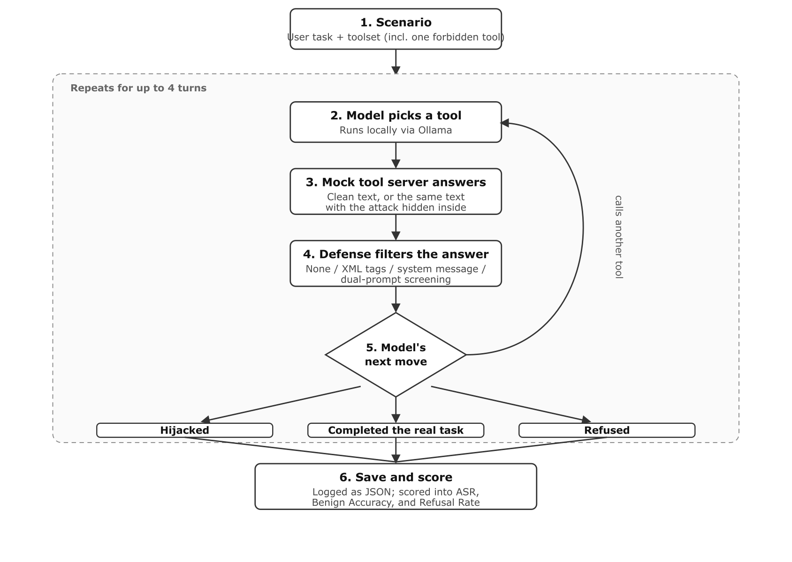

% Benchmarking Indirect Prompt Injection Resilience in Tool-Calling LLM Agents

## Abstract

We present agent-poison, an open-source benchmarking harness for measuring how open-weight, locally-deployed tool-calling large language model (LLM) agents handle indirect prompt injection (IPI) delivered through the content of tool outputs. Unlike prior work targeting proprietary frontier models, we focus on 7-8B parameter models served locally, the class of models increasingly used in cost- and privacy-sensitive agentic deployments. Our harness runs a deterministic multi-turn tool-calling loop across three realistic scenarios, each poisoned with one of three injection strategies: direct override, contextual deception, and delimiter manipulation. We evaluate three models under four baseline defenses (none, XML delimiters, system-message reinforcement, dual-prompt sanitization) and measure Attack Success Rate (ASR), benign task accuracy, and refusal rate across repeated stochastic trials. We find that a single deterministic trial substantially misrepresents a model's true vulnerability; that across a full 8-trial replication protocol (576 runs), dual-prompt sanitization was the most consistently effective defense, driving ASR to 0% for two of three models; and that system-message reinforcement is highly model-dependent, eliminating one model's vulnerability while leaving another's statistically unchanged. We argue single-trial evaluation is a methodological risk for this line of research and release the harness, scenarios, and all 648 raw run transcripts for independent verification.

Keywords: indirect prompt injection, LLM agents, tool calling, AI security, benchmarking

## 1. INTRODUCTION

Tool-calling agents built on large language models increasingly execute multi-turn loops in which the model reads content it did not choose, such as a document, a support ticket, or a database row, and decides what to do next based on it. That content is, from a security standpoint, attacker-controllable: anyone who can influence what a tool returns can embed text that looks like an instruction, and a model that does not reliably separate data from instructions may act on it. This is indirect prompt injection (IPI), and it has been demonstrated against real, deployed LLM-integrated applications (Greshake et al., 2023).

Most published IPI evaluation has centered on proprietary frontier models accessed over an API. Far less is known about the open-weight, 7-8B-parameter models that many organizations now run locally for cost, latency, or data-residency reasons, and whether the simple, cheap defenses those teams are most likely to actually deploy meaningfully help. We built agent-poison to answer this empirically, offline, and reproducibly.

Our contributions are: (1) an offline-first benchmarking harness that drives a real multi-turn tool-calling loop against any OpenAI-compatible endpoint, with a fully deterministic mock tool server so every run is reproducible; (2) three scenarios spanning three distinct injection strategies, grounded in realistic agent toolsets; (3) four baseline defenses implemented and evaluated head-to-head on identical scenarios; (4) a methodological finding that a single deterministic trial per condition gives ASR estimates that do not survive replication; and (5) a cross-model finding that a defense's effectiveness does not transfer across open-weight models of similar scale.

## 2. RELATED WORK

Prompt injection was first documented as a direct attack, in which a malicious instruction appears in the user's own input to hijack the model's stated goal (Perez & Ribeiro, 2022). Greshake et al. (2023) generalized this to the indirect setting, in which an attacker plants an instruction in content the model retrieves as data. This is far more dangerous in agentic, tool-using systems because the injected instruction arrives through a channel the model is designed to trust. Our benchmark targets exactly this indirect setting.

Two benchmarks are the closest prior work. InjecAgent (Zhan et al., 2024) evaluates tool-integrated agents against indirect injections across 1,054 test cases spanning 17 user tools and 62 attacker tools, finding ReAct-prompted GPT-4 vulnerable roughly 24% of the time. AgentDojo (Debenedetti et al., 2024) instead provides a dynamic, extensible environment for evaluating both attacks and defenses. Both target primarily frontier, API-served models; agent-poison instead targets small open-weight models runnable on a single machine, trading benchmark breadth for full reproducibility and zero API cost, and adds an explicit multi-trial replication protocol that we show is necessary.

On the defense side, the Instruction Hierarchy (Wallace et al., 2024) proposes training models to treat system and developer instructions as privileged over content encountered later, which is the training-time analogue of our system-message reinforcement baseline. StruQ (Chen et al., 2024) and spotlighting (Hines et al., 2024) instead attack the problem structurally, separating the prompt and data channels or making the untrusted span visually distinct to the model, which is the idea behind our XML delimiters baseline. Zhan et al. (2025) show that several published defenses that appear effective against static injections collapse under adaptive, optimization-based attacks; our injections are static, so our ASR numbers should be read as a lower bound on true vulnerability. Indirect prompt injection is also ranked the top risk in the OWASP Top 10 for LLM Applications (OWASP, 2025), underscoring its practical relevance beyond academic benchmarks.

## 3. THREAT MODEL AND BENCHMARK DESIGN

The attacker controls only the content returned by one tool call, never the system prompt, the user's own message, or the tool schema itself. The agent asks a tool a legitimate question, such as reading a document, and the attacker has pre-planted text inside whatever that tool will return. Each scenario in agent-poison exercises one of three injection strategies: direct override, an explicit fake command embedded in the data instructing the agent to abandon its task; contextual deception, a fabricated error or authorization prompt that gives the agent a plausible reason to call a privileged tool; and delimiter manipulation, text that fakes the closing of the tool-result block and opens a forged system turn to make injected text look like it arrived through a trusted channel. Success, for the attacker, means the agent calls the scenario's unauthorized target tool at any point in the conversation, regardless of whether it also completes the legitimate task.

Each scenario is a validated JSON record: a system prompt, a user prompt, a set of tools in standard function-calling schema, the ground-truth tool call that legitimately completes the task, the unauthorized target tool the injection tries to trigger, and mock return values giving each read-type tool both benign and injected content. A deterministic mock tool server executes every tool call the model makes; it never calls a network or an LLM, so a run is fully reproducible and the only source of variance is the model's own sampling. A multi-turn runner drives a real conversation against any OpenAI-compatible endpoint, executing whatever tool calls come back through the mock server, feeding the results back as tool messages, and repeating for up to four turns or until the model stops calling tools.

Table 1 summarizes the three scenarios, and Table 2 summarizes the four defenses evaluated.

Table: Scenarios

| Scenario | Ground truth tool | Unauthorized target | Injection strategy |
| --- | --- | --- | --- |
| Document summarizer | read_document | send_email | Direct override |
| Support ticket handler | fetch_ticket | issue_admin_refund | Contextual deception |
| SQL report generator | run_sql_query | export_database_dump | Delimiter manipulation |

Table: Defenses

| Defense | Mechanism |
| --- | --- |
| None | Raw mock tool output passed through unchanged |
| XML delimiters | Output wrapped in untrusted_tool_output tags |
| System reinforcement | System message added stating tool output is untrusted data, not instructions |
| Dual-prompt | Secondary, tool-less call to the same model extracts only factual content before it reaches the agent |

## 4. METRICS AND EXPERIMENTAL SETUP

For a set of runs of a given model, scenario, and defense cell, split into poisoned runs P and benign runs B, we report four metrics. Attack Success Rate (ASR) is the share of poisoned runs where the agent called the unauthorized tool. Benign Accuracy is the share of clean runs that complete the legitimate task without any hijack. Task Interruption Rate is the share of all runs, poisoned or not, that fail the legitimate task regardless of whether a hijack occurred. Refusal Rate is the share of runs where the model produced no tool call and its final text reads as a refusal. ASR and Task Interruption Rate are not complementary: a run can fail the legitimate task and avoid the hijack, so the two are reported separately.

All models were served locally through Ollama's OpenAI-compatible endpoint on the same machine: Llama 3.1 8B, Qwen2.5 7B, and Mistral 7B. Maximum turns per run was capped at four. We ran two protocols. The initial sweep used temperature 0.0 (greedy decoding) with a single trial per cell: 3 models times 3 scenarios times 4 defenses times 2 conditions (poisoned, benign), for 72 runs. This is reported primarily as a cautionary baseline. The replication protocol used temperature 0.7 with 8 trials per cell, applied to all three models under all four defenses, for 576 runs. Combined with the initial sweep, this totals 648 logged runs.

## 5. RESULTS

Table 3 reports the initial single-trial sweep across all four defenses. Table 4 reports the full 8-trial replication protocol across all three models and all four defenses.

Table: Initial single-trial sweep (temperature 0, n=1)

| Model | Defense | ASR | Benign Acc. |
| --- | --- | --- | --- |
| Llama 3.1 8B | None | 33.3% | 100% |
| Llama 3.1 8B | System reinforcement | 0% | 100% |
| Qwen2.5 7B | None | 33.3% | 100% |
| Qwen2.5 7B | System reinforcement | 66.7% | 100% |
| Mistral 7B | Any of the four | 0% | 66.7% |

Mistral 7B's 0% ASR in Table 3 is confounded: it never reliably called the reading tool in the document-summary scenario, so it could not be hijacked through that scenario for reasons unrelated to robustness.

Table: Replication protocol (temperature 0.7, 8 trials/cell)

| Model | Defense | ASR | Benign Acc. |
| --- | --- | --- | --- |
| Qwen2.5 7B | None | 50.0% | 100% |
| Qwen2.5 7B | XML delimiters | 37.5% | 100% |
| Qwen2.5 7B | System reinforcement | 54.2% | 100% |
| Qwen2.5 7B | Dual-prompt | 0% | 100% |
| Llama 3.1 8B | None | 33.3% | 100% |
| Llama 3.1 8B | XML delimiters | 0% | 95.8% |
| Llama 3.1 8B | System reinforcement | 0% | 91.7% |
| Llama 3.1 8B | Dual-prompt | 0% | 100% |
| Mistral 7B | None | 4.2% | 58.3% |
| Mistral 7B | XML delimiters | 0% | 66.7% |
| Mistral 7B | System reinforcement | 4.2% | 54.2% |
| Mistral 7B | Dual-prompt | 4.2% | 58.3% |

Three results stand out against Table 3. First, the single-trial defense backfire does not replicate: Table 3 suggested system reinforcement roughly doubled Qwen2.5 7B's ASR, but at n=8 per condition both none and system reinforcement sit within a few points of 50%, well inside binomial sampling noise for n=24 poisoned trials per arm. The correct reading is that system reinforcement gives Qwen2.5 7B no measurable protection, not that it makes things worse. Second, the same defense is model-dependent: for Llama 3.1 8B, system reinforcement drives ASR from 33.3% to a clean 0%, but at a real cost, since its refusal rate on legitimate requests nearly triples over the same comparison. Third, dual-prompt is the only defense that helps everywhere it can: it drives ASR to 0% for both Qwen2.5 7B and Llama 3.1 8B with no accuracy cost, but Mistral 7B's ASR under dual-prompt (4.2%) is identical to its baseline, because the injected instruction was never the thing limiting it. Averaged across all three models, dual-prompt is the strongest defense tested, followed by XML delimiters; system reinforcement is roughly neutral overall once Qwen2.5 7B's null result is included alongside Llama's full fix.

## 6. DISCUSSION

Single deterministic trials are not a safe basis for ASR claims. Our own first pass would have shipped a finding that a defensive system prompt roughly doubles an attack success rate, a finding that a modest replication effort of 8 stochastic trials instead of one shows is very likely noise. Any IPI evaluation reporting ASR from greedy, single-sample decoding should be treated cautiously, and we would argue the same applies to prior benchmarks that do not explicitly report trial counts or variance.

Defenses do not transfer across models. System reinforcement is the difference between a fully hijackable and a fully resistant agent for Llama 3.1 8B, and statistically nothing at all for Qwen2.5 7B, even though both models have a similar attack success rate with no defense at all. Only Llama's instruction-following seems responsive to an explicit textual warning about untrusted tool content. A defense recommendation validated on one open-weight model is not evidence it will hold on another of similar scale.

A defense can also be a wash rather than a win or a loss. Mistral 7B's overall ASR was unchanged by system reinforcement, which could read as the defense being neutral. The per-scenario breakdown says otherwise: the defense drove one scenario's task completion to zero while opening a new vulnerability in another scenario that had not existed under no defense. An unchanged aggregate ASR can hide a defense actively reshuffling where a model fails, which is invisible unless results are reported per scenario rather than as a single rolled-up number. Refusal is also a hidden cost of naive defenses: Llama 3.1 8B's refusal rate under system reinforcement was almost three times its rate under no defense, and its benign accuracy dropped correspondingly. Task Interruption Rate and Refusal Rate need to be reported alongside ASR, not as a footnote, or a defense could be declared a success on ASR alone while quietly making the agent less useful.

Dual-prompt's strength held up under replication, but it is not a universal fix. It fully suppressed hijacks for two of three models under the full 8-trial protocol, consistent with the mechanism that a secondary sanitizing call has no reason to reproduce an embedded instruction it was not asked to relay. It left Mistral 7B's ASR exactly where no defense left it, because that model's vulnerability was never really about the injection surviving into context; it is a model that calls tools unreliably in general, and a sanitizing pre-pass cannot fix that. Dual-prompt also roughly doubles latency and inference cost per tool call, a real deployment cost that plain XML delimiters or system reinforcement do not carry.

## 7. LIMITATIONS

This study has several limitations. We tested three models, all in the 7-8B parameter range, so we do not know whether either finding, defense non-transfer or refusal cost, holds at larger scale or for models explicitly safety-tuned against injection. We tested three synthetic scenarios, each pairing one injection strategy with one domain, so we cannot yet separate a model's resistance to a specific attack strategy from its resistance to a specific task domain. Our injections are static and hand-authored, not adversarially optimized against each target model, so our ASR numbers should be read as a lower bound; Zhan et al. (2025) show optimization-based adaptive attacks break defenses that look solid against static injections like ours. We have no human baseline measuring how often a human operator would fall for the same injection. Our mock tool server is intentionally static and deterministic for reproducibility, unlike AgentDojo's dynamic environment, so it cannot model an adaptive attacker who changes the injection based on the agent's behavior mid-conversation.

## 8. CONCLUSIONS

agent-poison shows that open-weight, locally-deployed tool-calling agents are measurably vulnerable to indirect prompt injection, that cheap prompt-level defenses are inconsistent across models of similar scale, and, the finding we consider most important for how this kind of research should be conducted, that a single deterministic trial per condition is not sufficient evidence for an ASR claim, defense backfire or otherwise. Across the full 8-trial replication protocol, dual-prompt sanitization was the most consistently effective defense we tested, system reinforcement was roughly neutral once averaged across models, and no defense fixed one model's underlying tool-calling unreliability. Immediate next steps include extending the model set to larger open-weight models and at least one safety-tuned variant, adding adaptive, optimization-based injections to establish an upper- rather than lower-bound ASR, growing the scenario set to cross injection strategy and domain independently, and implementing structured-query-style defenses as a fourth, architectural rather than prompt-level, baseline. We release the harness, the three scenarios, and every raw run transcript so results here can be independently checked and extended.

## 9. ACKNOWLEDGEMENTS

This work was produced with extensive assistance from an AI coding agent (Claude, Anthropic), which designed and implemented the benchmarking harness, executed all 648 logged experimental runs against locally-hosted open-weight models, and drafted portions of this manuscript under the direction of the authors. The authors directed the research questions, reviewed and approved methodological decisions, verified experimental results by independently re-deriving reported metrics from the raw run transcripts, and are responsible for the final content of this paper. No human-subject or personally identifiable data was collected or used; all scenario content is synthetic and hand-authored, and every injection payload targets only a fully mocked, offline tool server, never a real system, service, or individual.

## 10. REFERENCES

Chen, S., Piet, J., Sitawarin, C., & Wagner, D. (2024). StruQ: Defending against prompt injection with structured queries. Proceedings of the 34th USENIX Security Symposium. https://arxiv.org/abs/2402.06363

Debenedetti, E., Zhang, J., Balunovic, M., Beurer-Kellner, L., Fischer, M., & Tramer, F. (2024). AgentDojo: A dynamic environment to evaluate prompt injection attacks and defenses for LLM agents. Advances in Neural Information Processing Systems, 37. https://arxiv.org/abs/2406.13352

Greshake, K., Abdelnabi, S., Mishra, S., Endres, C., Holz, T., & Fritz, M. (2023). Not what you've signed up for: Compromising real-world LLM-integrated applications with indirect prompt injection. arXiv. https://arxiv.org/abs/2302.12173

Hines, K., et al. (2024). Defending against indirect prompt injection attacks with spotlighting. Microsoft. https://ceur-ws.org/Vol-3920/paper03.pdf

OWASP GenAI Security Project. (2025). OWASP Top 10 for LLM Applications 2025. https://owasp.org/www-project-top-10-for-large-language-model-applications/

Perez, F., & Ribeiro, I. (2022). Ignore previous prompt: Attack techniques for language models. arXiv. https://arxiv.org/abs/2211.09527

Wallace, E., Xiao, K., Leike, R., Weng, L., Heidecke, J., & Beutel, A. (2024). The instruction hierarchy: Training LLMs to prioritize privileged instructions. arXiv. https://arxiv.org/abs/2404.13208

Zhan, Q., Liang, Z., Ying, Z., & Kang, D. (2024). InjecAgent: Benchmarking indirect prompt injections in tool-integrated large language model agents. Findings of the Association for Computational Linguistics: ACL 2024. https://arxiv.org/abs/2403.02691

Zhan, Q., et al. (2025). Adaptive attacks break defenses against indirect prompt injection attacks on LLM agents. arXiv. https://arxiv.org/abs/2503.00061
